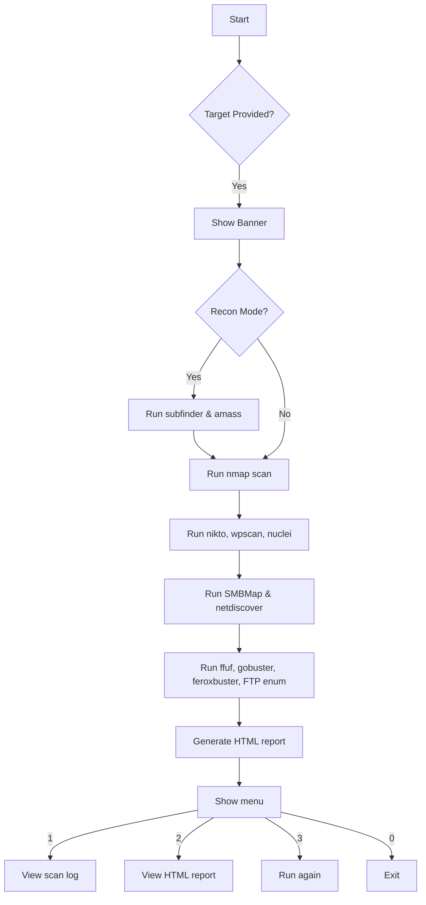

# 🛡️ Reconamil.sh
> Automated recon and scanning framework for bug bounty, pentesting & red teaming.


[](https://github.com/ravisairockey/Recon-Racket/actions/workflows/ci.yml)

---

## 🚀 What is Reconamil.sh?
**Reconamil.sh** is a modular, automated shell script built for recon and scanning:

- ✅ Subdomain enumeration (subfinder, amass)
- ✅ Port & service discovery (nmap)
- ✅ Vulnerability scanning (nikto, wpscan, nuclei)
- ✅ SMB scanning (SMBMap)
- ✅ Network discovery (netdiscover)
- ✅ Directory fuzzing (ffuf, gobuster, feroxbuster)
- ✅ FTP enumeration (nmap --script ftp*)
- ✅ HTML report & log export
- ✅ Interactive CLI menu for repeated scans

Crafted and maintained by **@AmilRSV**.

---

## 🔍 Workflow diagram



---

## ✨ Features

- Subdomain & recon tools: subfinder, amass
- Fast port & service scan: nmap
- Vulnerability scanning: nikto, wpscan, nuclei
- SMB enumeration: SMBMap
- Network discovery: netdiscover
- Directory brute-forcing: ffuf, gobuster, feroxbuster
- FTP enumeration: nmap --script ftp*
- Clean HTML report export
- Timestamped logs in `logs/` folder
- Interactive CLI menu
- Checks & prompts to install missing tools automatically

---

## 🧰 Installation & Setup

⚠️ **Requires:**

- `nmap`
- `subfinder`
- `amass`
- `nikto`
- `wpscan`
- `nuclei`
- `smbmap`
- `netdiscover`
- `ffuf`, `gobuster`, `feroxbuster`

```bash
git clone https://github.com/ravisairockey/Recon-Racket.git
cd Recon-Racket
sudo bash install.sh
```

## Installation

Get up and running with a single command. This will clone the repository, install all necessary dependencies, and create a symbolic link so you can run the script from anywhere.

```bash
git clone https://github.com/ravisairockey/Recon-Racket.git
cd Recon-Racket
sudo bash install.sh
```

---

## 📦 Usage

```bash
./Reconamil.sh -t example.com [-r] [-p ports]
```

| Option       | Description                                        |
|-------------:|---------------------------------------------------:|
| `-t target`  | Specify target domain or IP (**required**)        |
| `-r`         | Enable recon mode (subfinder, amass)              |
| `-p ports`   | Ports to scan (default: `top-ports 1000`)        |
| `-h`         | Show help                                         |

---

## 🧪 Example

```bash
./Reconamil.sh -t example.com -r -p "1-1000"
```

Expected:
- Runs subfinder & amass
- nmap scan on ports 1–1000
- nikto, wpscan, nuclei vulnerability checks
- SMB scan & network discovery
- Directory fuzzing & FTP enum
- Saves logs:
  - `logs/scan_TIMESTAMP.txt`
  - `logs/recon_TIMESTAMP.txt`
  - `logs/report_TIMESTAMP.html`

---

## 📊 HTML report preview

Includes:
- Target info
- Scan results & recon output
- Vulnerability findings
- SMB & FTP checks
- Directory fuzz results

*(Screenshot / template coming soon!)*

---

## 🛠️ Extending

Add even more tools easily:
- `httpx` for HTTP probing
- `Slack / Discord` notifications
- Automatic upload to dashboards

---

## 📂 Project structure

```plaintext
Recon-Racket/
├── Reconamil.sh
├── install.sh
├── logs/
├── docs/
└── README.md
```

---

## WordList > Pls update to ur use
-w /usr/share/dirbuster/wordlists/director-list-2.3-medium.txt

## ⚡ Contributing

Pull requests welcome!

**Tips:**
- Keep functions modular
- Use color codes for clarity
- Always log into `logs/`

---

## 📜 License

MIT License

---

## ✒️ Author

Made with ❤️ by **@AmilRSV**

> ⚔️ “Automation is the future of recon.”
